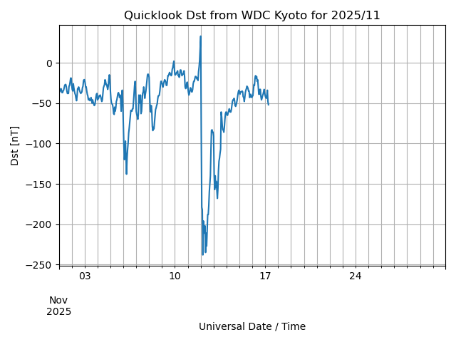

# Dst Plotter

Simple python script to download and plot the [quicklook Disturbance Storm Time (Dst) index](https://wdc.kugi.kyoto-u.ac.jp/dst_realtime/) from the World Data Centre (WDC) in Kyoto.

The real time data file is stored at https://wdc.kugi.kyoto-u.ac.jp/dst_realtime/presentmonth/dst2511.for.request

The script works by 

1. Downloading the realtime data file using `requests` library
1. Processing the data to a Pandas `DataFrame`
1. Creating a plot of the latest Dst. File save in `./currentplot.png`

